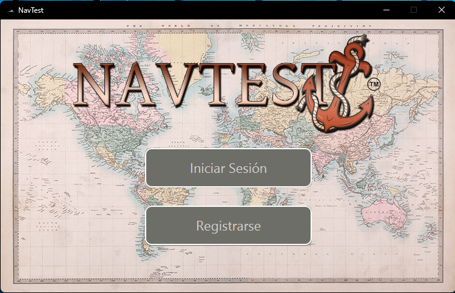
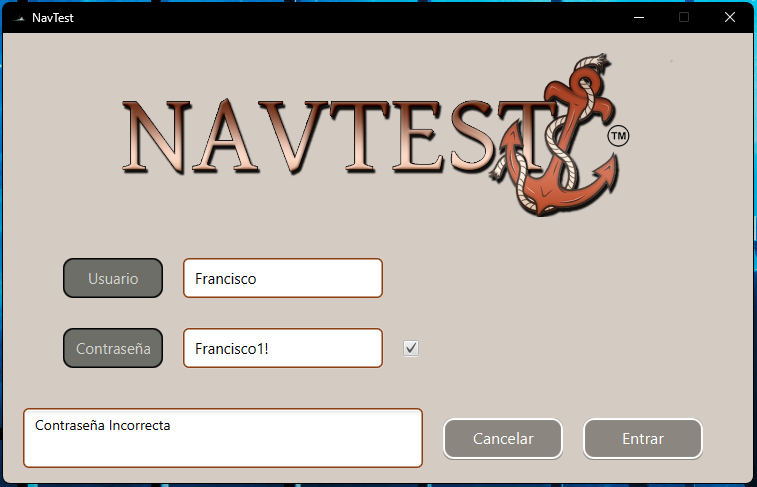
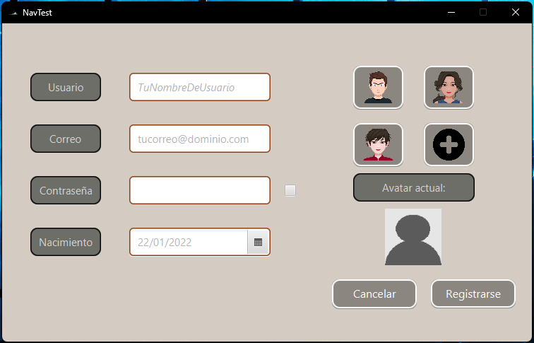
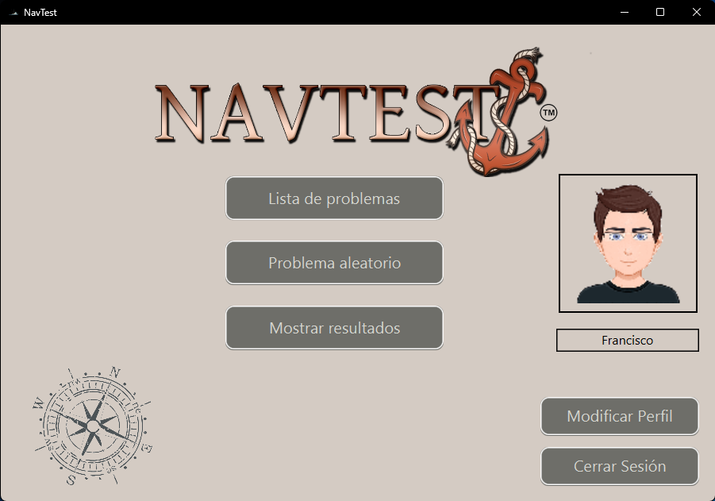
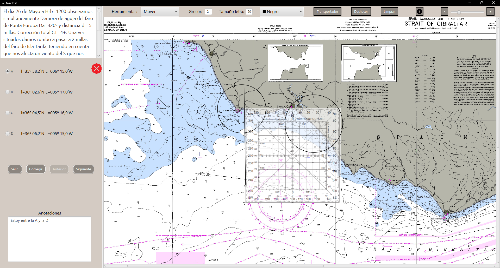
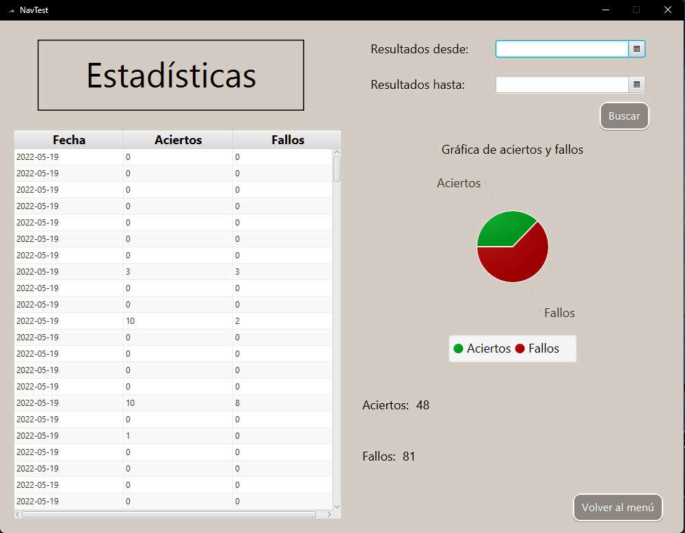

# NavTest
> [!Note]
> Trabajo en grupo desarrollado en la asignatura de IPC

## Introducción

La aplicación NavTest se especializa en la facilitación de exámenes de navegación para estudiantes. Este innovador sistema permite a los alumnos explorar sus habilidades de navegación al acceder a estadísticas detalladas sobre su desempeño. Mediante el uso de un mapa interactivo, los estudiantes pueden enfrentarse a problemas específicos relacionados con la navegación, ofreciendo así una experiencia educativa única.

## Tecnologias usadas

    
    &nbsp;&nbsp;&nbsp;&nbsp;
    &nbsp;&nbsp;&nbsp;&nbsp;
    
    &nbsp;&nbsp;&nbsp;&nbsp;
    &nbsp;&nbsp;&nbsp;&nbsp;
    

## Guia de uso

Para ejecutar este programa se ha hecho uso de netbeans y de la biblioteca javafx11.

## Capturas
Aqui se adjuntan una serie de capturas de los distintos apartados del proyecto.

### Menu Inicial

### Login y Registro

### Menu Principal

### Modificar Perfil

### Lista de problemas
Aqui estan todos los problemas posibles y se ve un texto con el enunciado.

### Examen
Aqui aparece el enunciado del problema, las opciones posibles de respuesta, un cuadro de texto para apuntar datos y un mapa en el cual podemos añadir lineas, arcos y tangentes ademas de utilizar una regla.

### Estadisticas
Aqui se acumulan los aciertos y los fallos de los problema, pudiendo filtrarlo por fechas.

